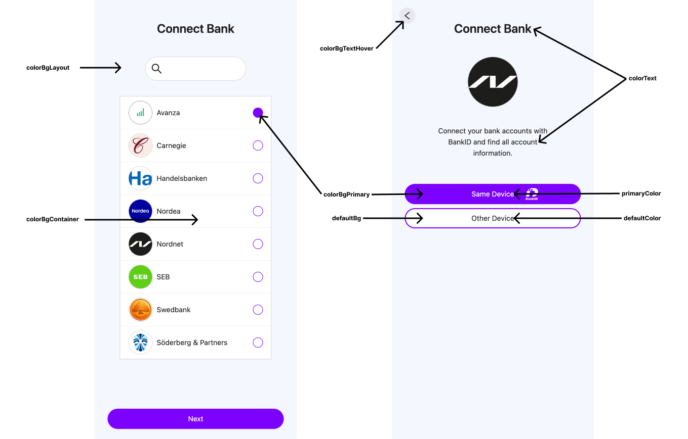
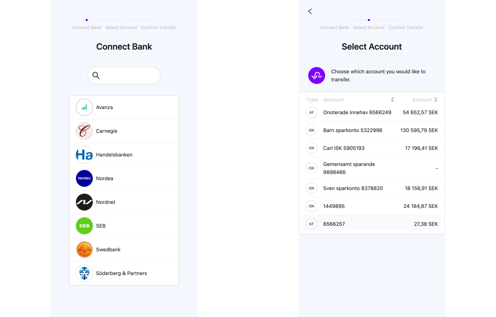
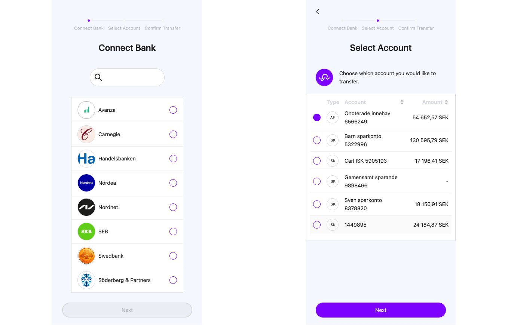

# Customization

You can change theme colors such as:



Declaring theme object and encoding it as a URI component.

```js
const theme = {
  colorPrimary: "#7D00FF",
  colorBgLayout: "#F5F7FE",
  colorBgContainer: "#FFFFFF",
  primaryColor: "#FFFFFF",
  defaultColor: "#000000",
  colorText: "#000000",
  colorBgTextHover: "#0000000f",
  defaultBg: "#FFFFFF",
};
const themeParams = encodeURIComponent(JSON.stringify(theme));
```

Append the URL parameter `theme` to your `authentication link`.

```js
const AUTH_LINK = authSdkLink + `/?api_key=${apiKey}&theme=${themeParams}`;
```

```html
<iframe src="{AUTH_LINK}" />;
```

### Radio buttons option

Lists looks as below by default:



You can change the lists appearance appending URL parameter `radio-buttons=true` to your `authentication link`.

```js
const AUTH_LINK = authSdkLink + `/?api_key=${apiKey}&radio-buttons=true`;
```

```html
<iframe src="{AUTH_LINK}" />;
```

Lists will look as below:


