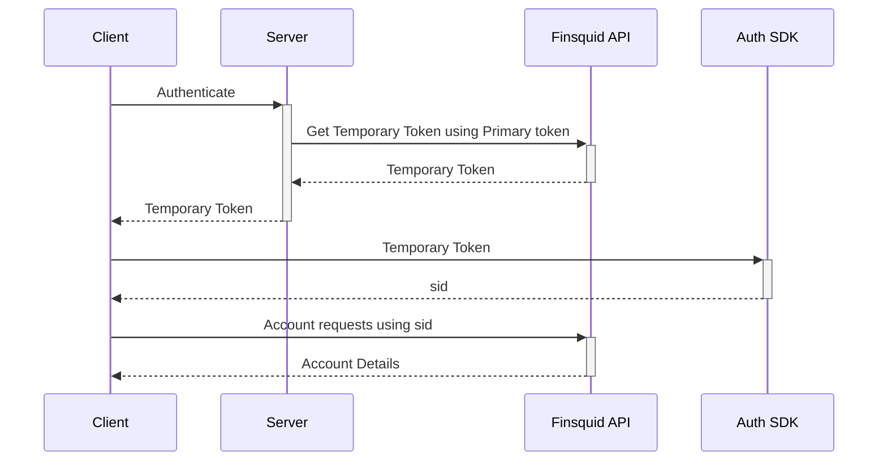
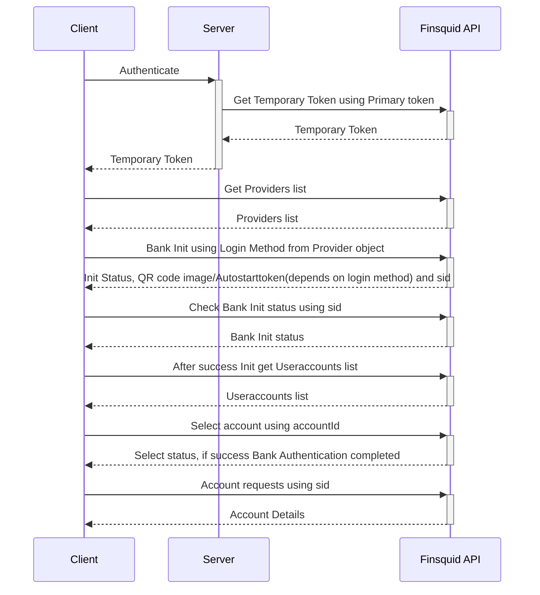
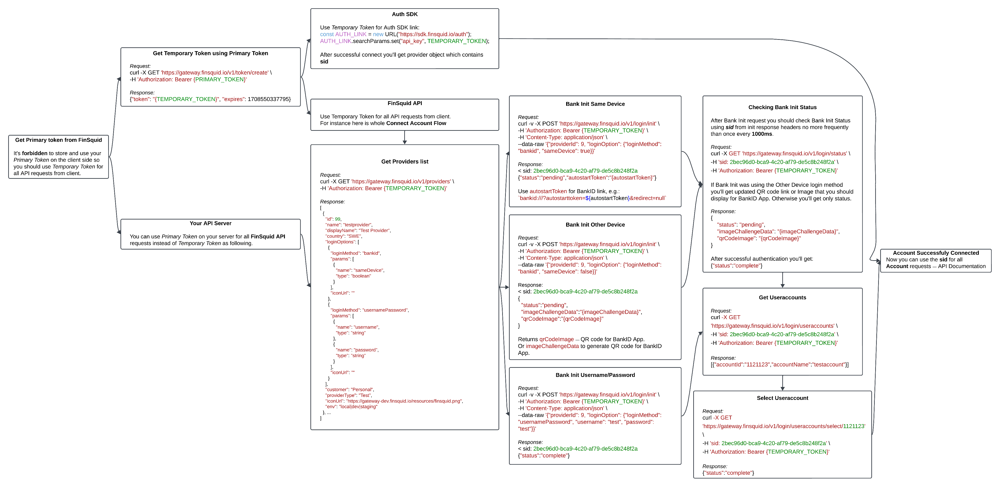

# Getting Started

First you need to get your `Primary Token` from [Finsquid](https://www.finsquid.io/contact). Using your Primary Token you should get Temporary Token.

It is **forbidden** to store your Primary Token on the client side so you should use Temporary Token for all API requests from client. However you can use Primary Token on your server in the same way.

## Getting Temporary Access Token

You can get Temporary Token using the `GET v1/token/create` endpoint. The request must be authenticated using your primary token.

Request:
```bash
curl -X GET 'https://gateway-staging.finsquid.io/v1/token/create' \
-H 'Authorization: Bearer {PRIMARY_TOKEN}'
```
Response:
```bash
{
  "token": "{TEMPORARY_TOKEN}",
  "expires": 1708550337795
}
```

### You should use this token for SDK links:
```js
const AUTH_LINK = new URL("https://sdk-staging.finsquid.io/auth");
AUTH_LINK.searchParams.set("api_key", TEMPORARY_TOKEN);
AUTH_LINK.searchParams.set("iframe", true);
```
```html
<iframe src="{AUTH_LINK}" />
```
### [Auth SDK Documentation](auth-sdk.html)

### And for all API requests from client.
For instance to get providers list:
```bash
curl -X GET 'https://gateway-staging.finsquid.io/v1/providers' \
-H 'Authorization: Bearer {TEMPORARY_TOKEN}'
```

### [API Documentation](https://gateway-staging.finsquid.io/doc)

## Flow Diagrams

### Auth SDK Flow Diagram


### Manual Flow Diagram


### Detailed Flow Diagram
[](./images/flow-diagram.png)

### [API Documentation](https://gateway-staging.finsquid.io/doc)