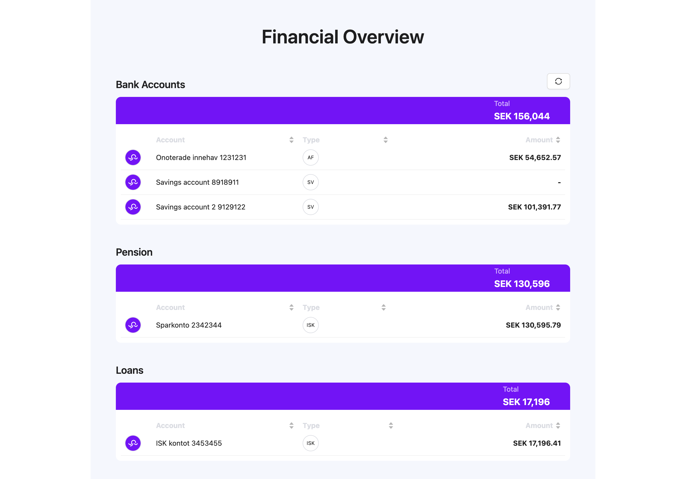
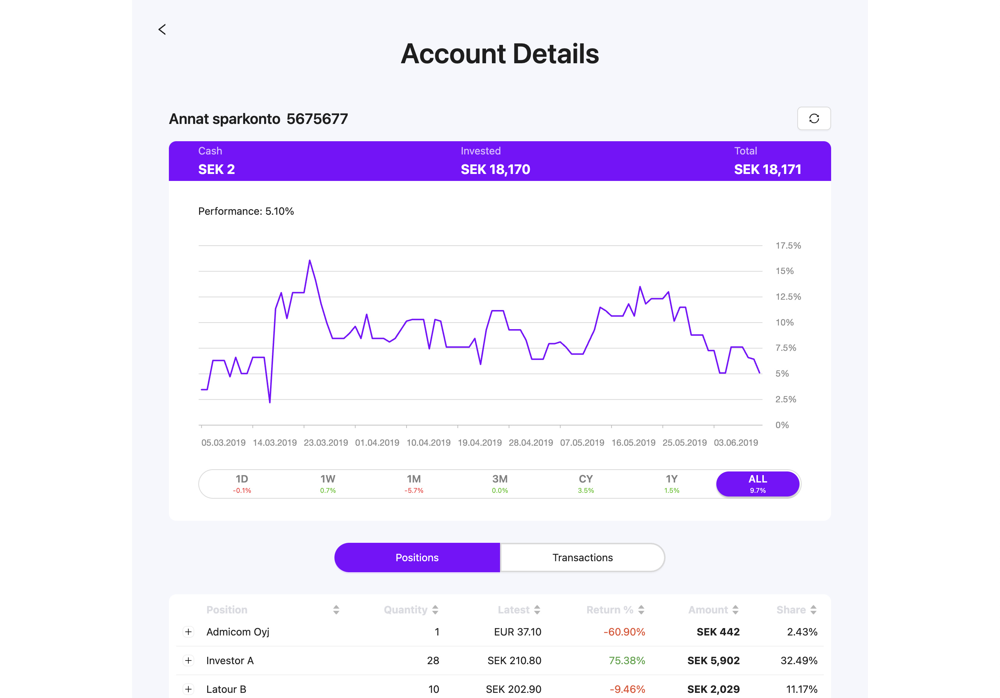
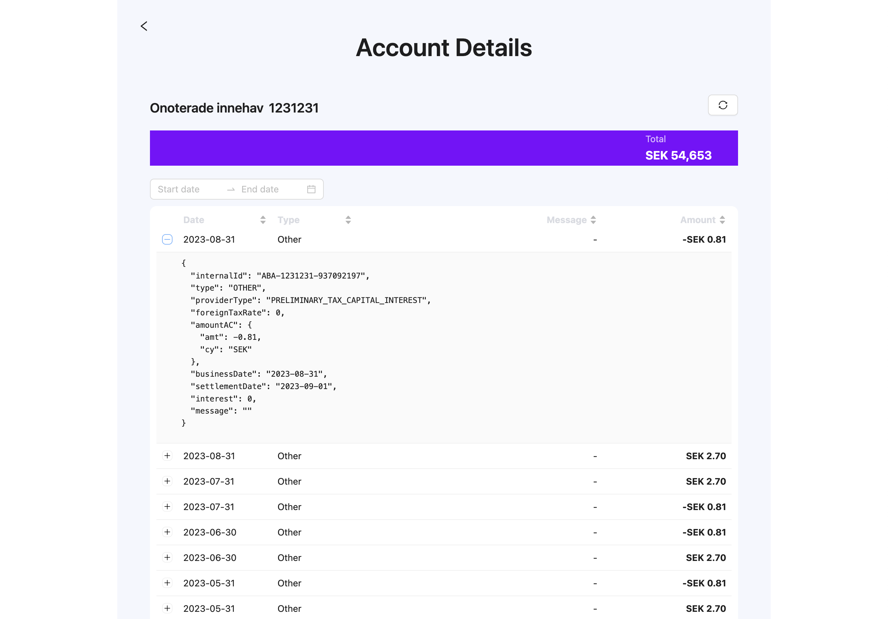

# FinSquid SDK for Web

## FinSquid SDK includes:

### [Auth SDK](auth-sdk.html) is our front-end web SDK for account authentication.

### [Aggregate SDK](aggregate-sdk.html) is our front-end web SDK for aggregation and displaying accounts that also includes authentication using [Auth SDK](auth-sdk.html) under the hood.

#### Financial Overview

#### Investment Account Details

#### Bank Account Details

Please refer to our product page for more information about [FinSquid](https://www.finsquid.io).

And [how it works](https://www.finsquid.io/how-it-works).
