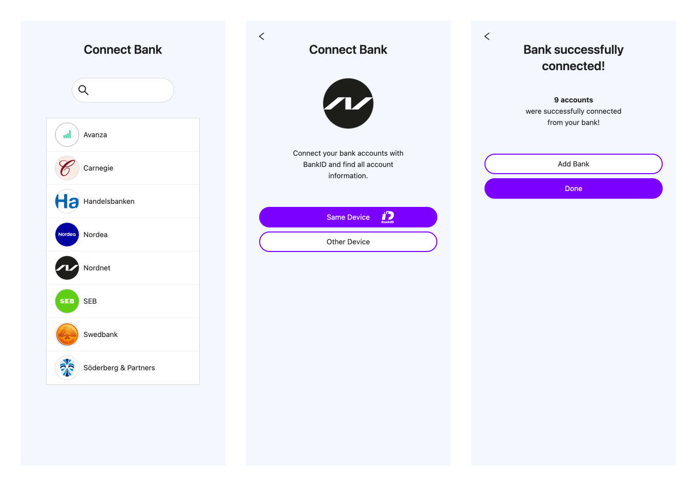

Finsquid Auth is our front-end web SDK for account authentication.

Please refer to our product page for more information about [Finsquid](https://www.finsquid.io).

And [how it works](https://www.finsquid.io/how-it-works).

## [Getting started](./docs/getting-started.md)

<button class="btn js-toggle-dark-mode">Preview dark color scheme</button>

