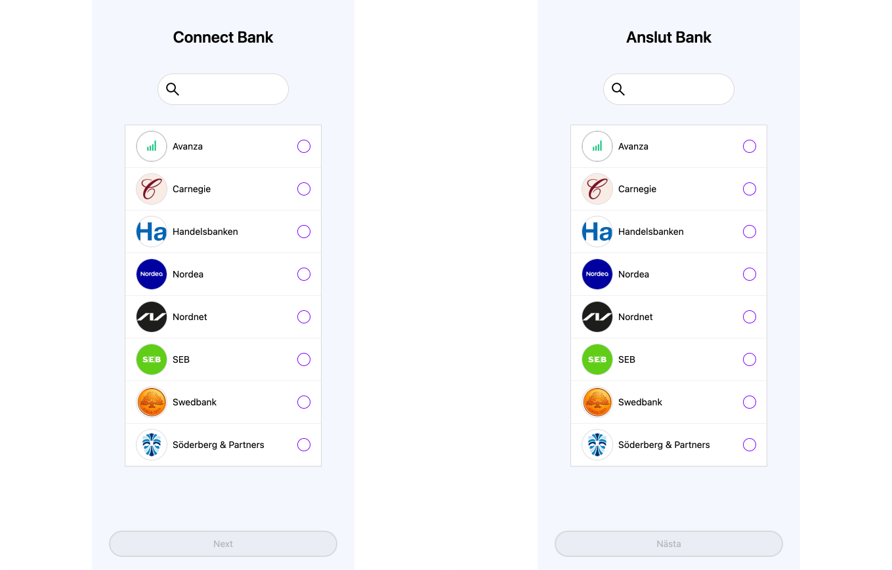

# Localization

Finsquid SDK supports English and Swedish languages:



You can change the language appending URL parameter `lang=sv` to your `sdk link`.

```js
// lang values - 'en' or 'sv'
const lang = "en";
const SDK_LINK = new URL(sdkLink);
SDK_LINK.searchParams.set("lang", lang);
```

```html
<iframe src="{SDK_LINK}" />;
```
