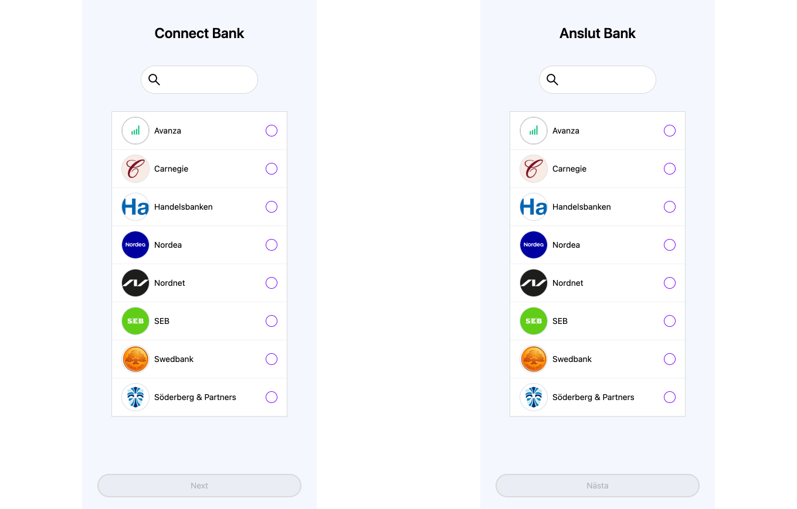

# Localization

Finsquid Auth SDK supports English and Swedish languages:



You can change the language appending URL parameter `lang=sv` to your `authentication link`.

```js
// lang values - 'en' or 'sv'
const lang = "en";
const AUTH_LINK = authSdkLink + `/?api_key=${apiKey}&lang=${lang}`;
```

```html
<iframe src="{AUTH_LINK}" />;
```
